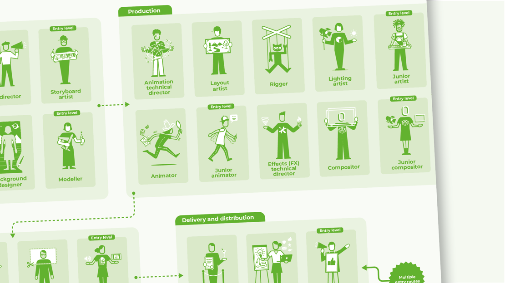

# CareerCatalyst — ATS Scanner

An ATS-focused resume analyzer combining a React frontend and a lightweight Python backend. It parses resumes, matches keywords against job descriptions, and provides actionable feedback to improve ATS compatibility.

## Features
- Resume parsing and keyword matching
- Score vs. job description alignment
- Actionable improvement suggestions
- Simple local setup for frontend and backend

## Project Structure
- Frontend (React): CareerCatalyst2/CareerCatalyst/src/pages/ATSResume*.jsx and related components in src/components/
- Backend (Python): CareerCatalyst2/CareerCatalyst/backend/ats_analyzer.py and supporting files

## Quick Start
### Frontend
`ash
cd CareerCatalyst2/CareerCatalyst
npm install
npm start
`

### Backend
`ash
cd CareerCatalyst2/CareerCatalyst/backend
pip install -r requirements.txt
python app.py
`

## Screenshots
> Images are stored within the app and referenced directly.

## How It Was Built
- UI built with React (components in src/components) and pages under src/pages.
- Styling through CSS/Tailwind configuration (see 	ailwind.config.js, src/styles/App.css).
- Backend built with Python (Flask-style app in ackend/app.py), ATS logic in ackend/ats_analyzer.py.
- Development scripts: start_frontend.bat, start_backend.bat, and start_app.ps1.

## Notes
- The folder CareerCatalystash/ is intentionally excluded from version control.
- Node modules and Python virtual environments are ignored.

## License
MIT
